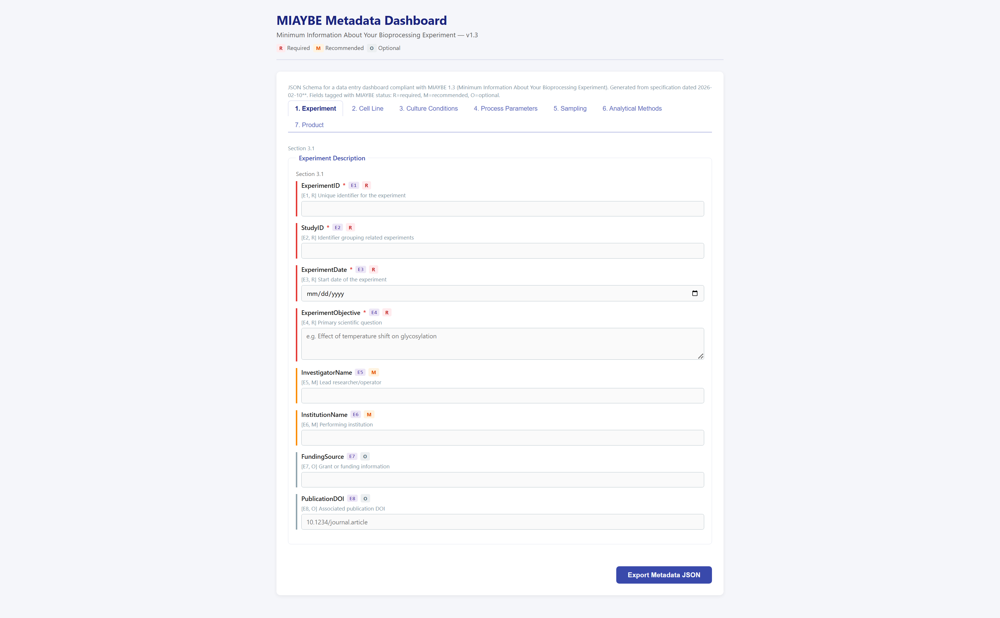
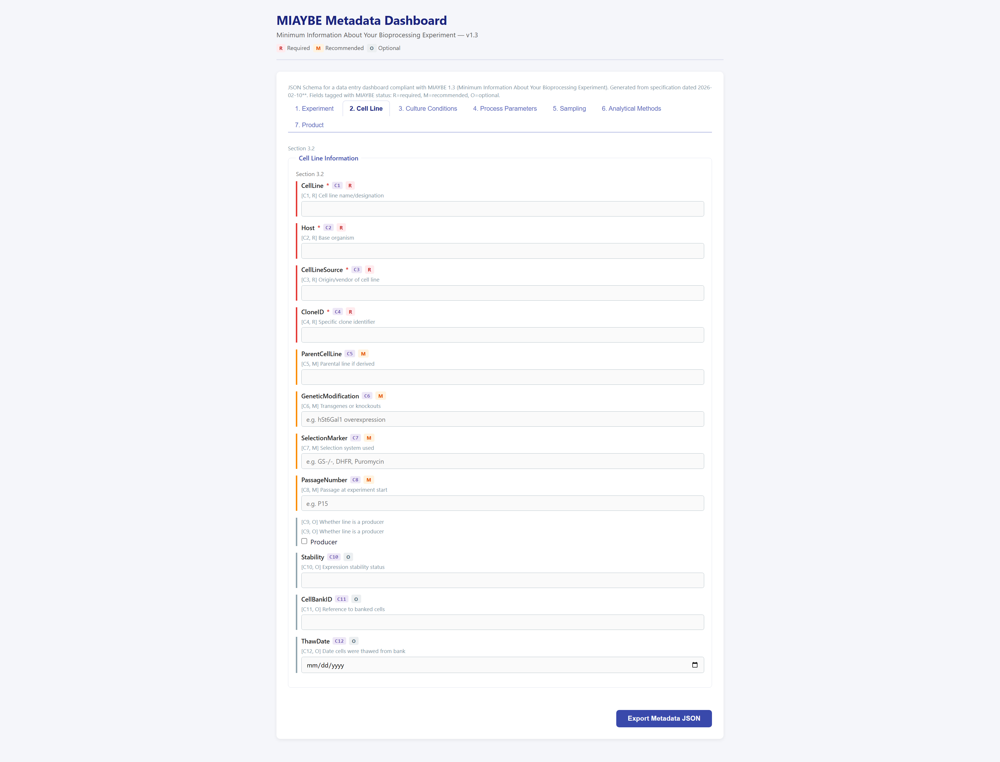
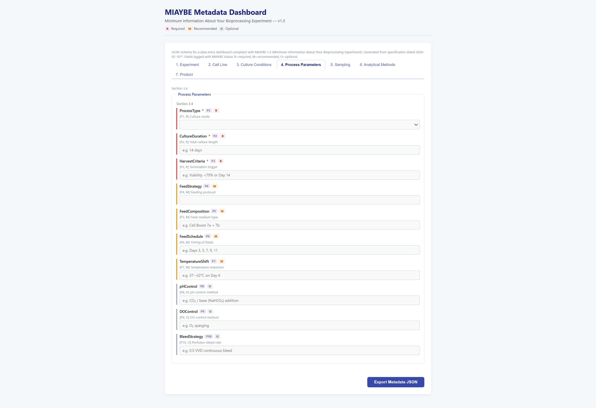
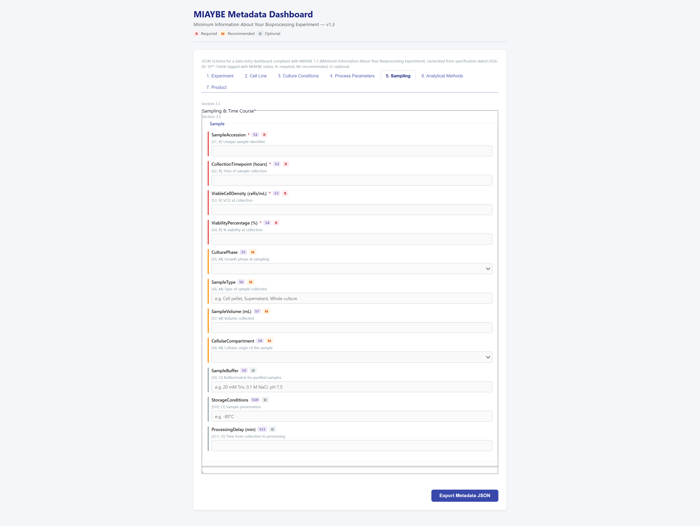
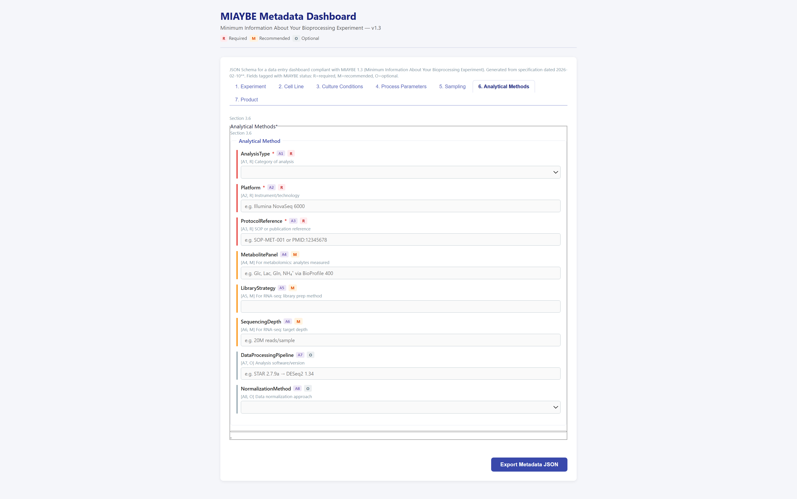
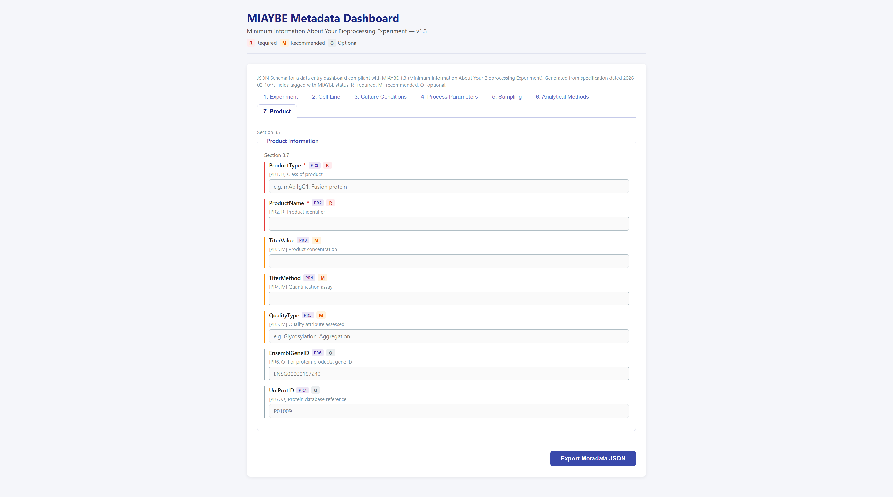

# MIAYBE — Minimum Information About Your Bioprocessing Experiment

[](https://doi.org/10.5281/zenodo.20829996)


Draft Manuscript: [MIAYBE the Data Will Tell Us](https://lewis.uga.edu/wp-content/uploads/2026/06/MIAYBE-the-Data-Will-Tell-Us.pdf)

A metadata standard and toolchain for describing mammalian cell culture bioprocessing experiments in a way that is unambiguous, machine-readable, and comparable across studies.

---

## Why does this exist?

Biologics manufacturing (CHO cell culture, monoclonal antibodies, recombinant proteins) produces enormous amounts of data — transcriptomics, metabolomics, titer measurements, glycosylation profiles. But without standardized metadata describing *how* the experiment was run, that data is nearly impossible to reuse:

- You cannot reproduce a culture run if temperature, pH, feed strategy, and cell line passage are missing.
- You cannot do cross-study meta-analysis if each lab names the same thing differently.
- Machine learning models cannot learn from pooled datasets if experimental context is inconsistent.

MIAYBE defines the **minimum set of fields** that must be recorded alongside any bioprocessing experiment's data. It follows the precedent of MIAME (microarray), MIQE (qPCR), and MIAPPE (plant phenotyping).

---

## What's in this repository

| File | Purpose |
|------|---------|
| `MIAYBE.md` | The specification — 71 metadata fields across 7 categories, with definitions, examples, and competency question mappings |
| `miaybe_md_to_schema.py` | Parses `MIAYBE.md` and generates a JSON Schema for validation and form generation |
| `miaybe_schema_generated.json` | The generated JSON Schema (committed artifact; regenerate after editing `MIAYBE.md`) |
| `dashboard/` | Sample React app using [RJSF](https://rjsf-team.github.io/react-jsonschema-form/) to render a metadata entry form from the schema |

---

## The 7 metadata categories

| # | Category | Required fields (examples) |
|---|----------|---------------------------|
| 1 | **Experiment Description** | ExperimentID, StudyID, ExperimentDate, Objective |
| 2 | **Cell Line Information** | CellLine, Host, CellLineSource, CloneID |
| 3 | **Culture Conditions** | Temperature, pH, DissolvedOxygen, BaseMedium |
| 4 | **Process Parameters** | ProcessType (Batch/FedBatch/Perfusion), CultureDuration |
| 5 | **Sampling & Time Course** | SampleAccession, CollectionTimepoint, ViableCellDensity |
| 6 | **Analytical Methods** | AnalysisType, Platform, ProtocolReference |
| 7 | **Product Information** | ProductType, ProductName |

Fields are classified as **Required (R)**, **Recommended (M)**, or **Optional (O)**. See `MIAYBE.md` for the full checklist.

---

## Quickstart

### 1. Regenerate the JSON Schema after editing the spec

```bash
python miaybe_md_to_schema.py MIAYBE.md -o miaybe_schema_generated.json
```

No dependencies beyond Python's standard library.

### 2. Run the metadata entry dashboard

```bash
cd dashboard
npm install
npm run dev
```

Opens a browser form with one tab per MIAYBE section. Filling in the form and clicking **Export Metadata JSON** downloads a validated JSON file ready for submission to a data repository.

---

## Dashboard screenshots



*Tab 1 — Experiment Description. Required fields (red R) must be filled; Recommended (orange M) and Optional (grey O) fields carry visual badges derived directly from the JSON schema.*

<table>
  <tr>
    <td></td>
    <td></td>
  </tr>
  <tr>
    <td align="center"><em>2 — Cell Line Information</em></td>
    <td align="center"><em>3 — Culture Conditions (numeric fields with units)</em></td>
  </tr>
  <tr>
    <td></td>
    <td></td>
  </tr>
  <tr>
    <td align="center"><em>4 — Process Parameters (enum dropdowns)</em></td>
    <td align="center"><em>5 — Sampling &amp; Time Course (repeatable array items)</em></td>
  </tr>
  <tr>
    <td></td>
    <td></td>
  </tr>
  <tr>
    <td align="center"><em>6 — Analytical Methods (repeatable array items)</em></td>
    <td align="center"><em>7 — Product Information</em></td>
  </tr>
</table>

---

## Updating the spec — end-to-end pipeline

When the MIAYBE specification changes (new fields, revised definitions, new enum values), follow this pipeline to propagate changes through to the dashboard:

```
MIAYBE.md  ──(1)──▶  miaybe_schema_generated.json  ──(2)──▶  dashboard
   ▲                                                               │
   │                                                               │
 edit spec                                                   mostly automatic;
                                                          see step 2 notes below
```

### Step 1 — Edit the spec and regenerate the schema

Edit `MIAYBE.md` (add/rename fields, change status, update definitions), then run:

```bash
python miaybe_md_to_schema.py MIAYBE.md -o miaybe_schema_generated.json
```

Commit both `MIAYBE.md` and `miaybe_schema_generated.json` together.

### Step 2 — Review the dashboard impact

Most changes propagate to the dashboard automatically because the form is schema-driven:

| What changed in the spec | Dashboard impact | Manual action needed? |
|--------------------------|------------------|-----------------------|
| Field renamed | New camelCase property key in schema | Update `uiSchema.js` if a placeholder/widget override referenced the old key |
| New field added | Appears in the correct section tab automatically | Optionally add a placeholder to `uiSchema.js` |
| Field removed | Disappears from the form automatically | Remove any stale `uiSchema.js` entry for that key |
| New enum value | Added to the select dropdown automatically | None — but `ENUM_OVERRIDES` in the generator may need updating |
| Section added (new `### 3.x`) | Parsed into the schema automatically | Add the new key to `SECTION_LABELS` in `SectionTabsTemplate.jsx` and to `SECTION_META` in the generator |
| Section removed | Disappears automatically | Remove the key from `SECTION_LABELS` in `SectionTabsTemplate.jsx` |
| Long-text field needs a textarea | Not automatic | Add `'ui:widget': 'textarea'` in `uiSchema.js` |
| Date field without `format: date` | Not automatic | Add `'ui:widget': 'date'` in `uiSchema.js` |

The two dashboard files that may need manual updates are:

- **`dashboard/src/uiSchema.js`** — widget overrides (textarea, date) and placeholder text, keyed by the camelCase property name produced by the schema generator.
- **`dashboard/src/SectionTabsTemplate.jsx`** — the `SECTION_LABELS` object maps schema property keys to human-readable tab names.

Everything else (field order, types, validation, required/optional badges, array sections) updates automatically from the regenerated JSON.

---

## How the schema generator works

`miaybe_md_to_schema.py` parses the Markdown tables in sections 3.1–3.7 of `MIAYBE.md` and produces a JSON Schema (draft 2020-12) with:

- **Type inference** — numeric fields (temperature, pH, VCD, …) become `number` with appropriate `minimum`/`maximum`; date fields get `format: "date"`; producer gets `boolean`.
- **Enum constraints** — controlled vocabularies for `processType`, `culturePhase`, `analysisType`, etc.
- **Pattern validation** — Ensembl gene IDs, UniProt IDs, and DOIs are validated by regex.
- **Array sections** — sampling timepoints and analytical methods are `array` types, supporting multiple entries per experiment.
- **MIAYBE metadata** — each property carries a `miaybe` extension object with `{ id, status, unit, cqMapping }` for downstream tooling.

---

## Relationship to MCBO

MIAYBE fields map directly to the [MCBO (Mammalian Cell Bioprocessing Ontology)](https://github.com/lewiscelllabs/mcbo) data dictionary, enabling ontology-driven knowledge graphs and multi-agent LLM query pipelines over pooled bioprocessing datasets.

---

**License**: MIT

---

## Citation

If you use MIAYBE, please cite the archived release:

Lewis Cell Labs. (2026). *MIAYBE: Minimum Information About Your Bioprocessing Experiment* (v0.1.0) [Computer software]. Zenodo. https://doi.org/10.5281/zenodo.20829996)
